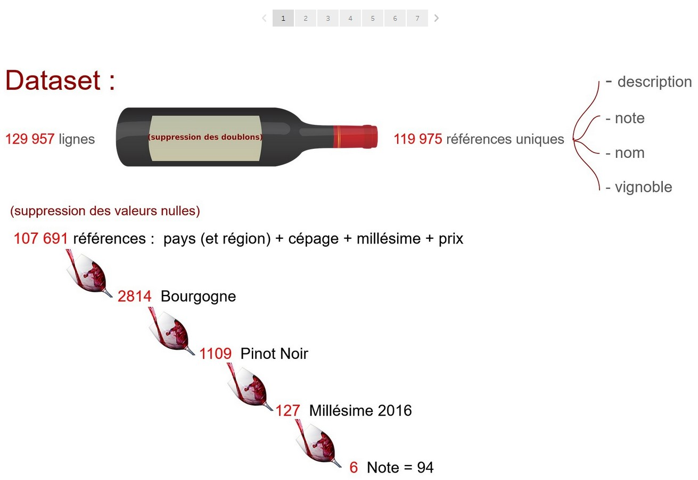

<h1 align="center"> Hi 👋 my name is Manu :smiley: </h1>
<!-- Intro -->

    

:dart: <b><i>I'm looking for an apprenticeship as Data Engineer</i></b>

<h1>
</h1>

I'm passionate about numbers (as a math teacher and in my daylife) and computer programming  

 
- :computer: <b>I'm a Data Analyst (trained at <a href="https://wildcodeschool.com">Wild Code School</a> with RNCP title).</b>

- 📫 How to reach me: manuelmusy8@gmail.com

- :open_file_folder: <a href ="https://theperk08.github.io/">My portfolio</a>

- :page_facing_up: <a href = "https://theperk08.github.io/assets/resume/CV%20Manuel%20MUSY.pdf">My resume</a>

Passions :
 - :milky_way: Astrophotography
 - :sunrise_over_mountains: CMZ, Ardennes and nature

Sports / Entertainments :
- :minidisc: Ultimate frisbee (yes, that's a sport with good and fun spirit)
- :earth_africa: geocaching
- :bike: bike

<!-- Experience -->
<!-- Tableau Dataviz -->
<h1 align="center"><a href ="https://public.tableau.com/app/profile/manuel.musy">My last Tableau Dataviz :</a> </h1>

  <table>
        <tr>
            <td width="50%">
                <h3 align="center">
                    <a href="https://public.tableau.com/app/profile/manuel.musy/viz/tudeMarchVins/Histoire1" target="_blank" rel="noreferrer"> Étude Marché de Vins</a>
                </h3>
                

                    
                    

                        A dashboard for a price recommandation for a french wine on the US market
                    

					

						

						<b>Note 📝</b>
						

						RNCP title of Data Analyst
					

            

            </td>
            <td width="50%">
                <h3 align="center">
                    <a href="https://public.tableau.com/app/profile/manuel.musy/viz/ConsommationlectriqueEnedis/Tableaudebord1" target="_blank" rel="noreferrer">Consommation électrique Enedis</a>
                </h3>
                

                    
                    

                        Electricity consumption
                    

					

						

						<b>Note 📝</b>
						

						Electricity consumption for households and small enterprises with Enedis
					

                

            </td>
        </tr>
  </table>
	

<!-- Power Bi Dataviz -->
<h1 align="center">My last Power Bi Dataviz :</h1>

  <table>
        <tr>
            <td width="50%">
                <h3 align="center">
                    <a href="https://github.com/theperk08/aeroports" target="_blank" rel="noreferrer"> Étude Trafic Passagers aux aéroports</a>
                </h3>
                

                    
                    

                        A dashboard about the passengers trafic on french airports
                    

					

						

						<b>Note 📝</b>
						

						dashboard with SQL and Power Bi
					

            

            </td>
            <td width="50%">
                <h3 align="center">
                    <a href="https://github.com/theperk08/Product_sales" target="_blank" rel="noreferrer">Product Sales</a>
                </h3>
                

                    
                    

                        Product Sales
                    

					

						

						<b>Note 📝</b>
						

						Dashboard with SQL and Power Bi
					

                

            </td>
        </tr>
  </table>

<!-- Streamlit Projects -->

 <h1 align="center">My last Streamlit Projects :</a> </h1>

  <table>
        <tr>
            <td width="50%">
                <h3 align="center">
                    <a href="https://cyclam-stations.streamlit.app" target="_blank" rel="noreferrer"> Statistiques Stations Cyclam</a>
                </h3>
                

                    
                    

                        Statistics about electrical bike stations
                    

					

						

						<b>Note 📝</b>
						

						Interactive dashboard for statistics (collected during one month via API in real time) about electrical bike locations stations. 
					

            

            </td>
            <td width="50%">
                <h3 align="center">
                    <a href="https://ardennes-mobilite.streamlit.app/ target="_blank" rel="noreferrer">Sustainable mobility in Ardennes</a>
                </h3>
                

                    
                    

                        Interactive map with sustainable mobility points
                    

					

						

						<b>Note 📝</b>
						

						Interactive map to find sustainable mobility points from an address in Charleville-Mézières
					

                

            </td>
        </tr>
  </table>
	
<!-- Personal Projects -->

 <h1 align="center">My last Python Softwares :</a> </h1>

  <table>
        <tr>
            <td width="50%">
                <h3 align="center">
                    <a href="https://github.com/theperk08/dkrypton" target="_blank" rel="noreferrer"> Dkrypton</a>
                </h3>
                

                    
                    

                        Cryptanalysis and Decipher Software
                    

					

						

						<b>Note 📝</b>
						

						Software (in Python) to decipher basics Caesar, Vigenere... with cryptanalysis
					

            

            </td>
            <td width="50%">
                <h3 align="center">
                    <a href="https://github.com/theperk08/SDR_decoder" target="_blank" rel="noreferrer">SDR Decoder</a>
                </h3>
                

                    
                    

                        ACARS and POCSAG messages decoder
                    

					

						

						<b>Note 📝</b>
						

						Software (in Python) to decode ACARS (aviation) and POCSAG (text messaging) messages (via an RTL-SDR dongle)
					

                

            </td>
        </tr>
  </table>

<!-- Technos -->
<h1 align="center">Languages and Tools 🛠</h1>
<h3 align="center">Programming</h3>

    	

<h3 align="center">Data</h3>

    
    
	
	

	
	
	
	
	
	

	
	

<h3 align="center">Front</h3>

    
    

<h3 align="center">Astrophotography</h3>

    
    
    

- :snake:  Numpy

- :pager: POCSAG and :airplane: ACARS messages

$${\color{blue}La \space vie \space est \space belle}$$

<!--
**theperk08/theperk08** is a ✨ _special_ ✨ repository because its `README.md` (this file) appears on your GitHub profile.

Here are some ideas to get you started:

- 🔭 I’m currently working on ...
- 🌱 I’m currently learning ...
- 👯 I’m looking to collaborate on ...
- 🤔 I’m looking for help with ...
- 💬 Ask me about ...
- 📫 How to reach me: ...
- 😄 Pronouns: ...
- ⚡ Fun fact: ...
-->
